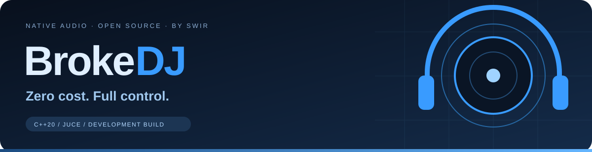
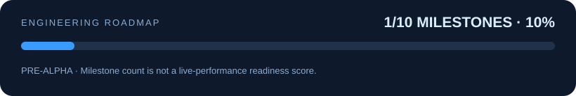

<p align="center"></p>
<p align="center">
  <a href="https://github.com/Swir/BrokeDJ/actions/workflows/build.yml"></a>
  
  
  
  <a href="LICENSE"></a>
</p>
<p align="center"><b>An open-source DJ workstation with a professional destination — and an honest development status.</b><br>Windows 11 x64 first · Native C++ audio · No subscription, ads, or mandatory account</p>
<p align="center"><a href="#current-build">Current build</a> · <a href="ROADMAP.md">Roadmap</a> · <a href="docs/BUILDING.md">Build</a> · <a href="docs/ARCHITECTURE.md">Architecture</a> · <a href="docs/TESTING.md">Validation</a></p>

> **Development build 0.1.0, not a production release.** BrokeDJ is being built toward a full four-deck DJ workstation. VST3 hosting, beat sync, key lock, a full effects collection, a sampler, stems and a persistent music library are **planned**, not working features of this first commit. Do not use this build as your only system at a live event.

## Current build

| Area | Implemented in source | Validation / limits |
|---|---|---|
| Audio core | Four stereo decks; variable-rate playback; start/pause; seek; whole-track loop | Dependency-free C++ tests pass. Rate changes pitch; no key lock or beat grid. |
| Mixer | Channel gain; basic three-band EQ; equal-power crossfader; master gain | A/C are assigned left, B/D right. Not yet a configurable professional mixer. |
| Effects | Fixed 250 ms feedback echo and saturation per deck | Two effects, not 40 presets disguised as effects. Beat sync and effect chains are pending. |
| Cue | Pre-fader, post-EQ/FX stereo headphone bus | Outputs 3/4 only. Two-output devices do not receive cue mixed into master. Hardware validation pending. |
| Import | Background decoding of local WAV, AIFF, FLAC, OGG and MP3 through JUCE | Mono/stereo only; 256 MiB decoded stereo cap per track. No streaming decoder yet. |
| Interface | Four deck panels, waveforms, drag/drop, audio settings and clickable `by Swir` credit | Native JUCE source; Windows build and manual usability qualification tracked separately. |
| Language | Polish selected for a Polish system; otherwise English | Decoder diagnostics currently fall back to English. No global translation claim. |
| Reliability | Immutable clip handoff; deferred destruction; bounded output; shutdown cancellation | Core ASan/UBSan suite passes. No latency, ASIO, controller or live reliability certification. |

The output clamp is last-resort **sample clipping protection**, not a transparent limiter. Lower gain when the clipping warning appears. The waveform shows decoded amplitude, not detected beats or musical phrases.

## Progress

<p align="center"></p>

The graphic is generated from [`docs/progress.json`](docs/progress.json). It counts explicit roadmap milestones equally; it is **not a measurement of sound quality, time remaining, or readiness for a live set**. No simulated progress and no ASCII progress bars.

## Product destination

**Performance:** four fully equipped decks, corrected beat grids, tempo/key analysis, key lock, hotcues, beat loops, slip, reverse and scratch workflows.

**Sound:** a configurable mixer, approximately 30–40 genuinely distinct built-in effects, serial/parallel chains, effect sends, XY/macros, presets and external VST3 effects. The VST3 scanner, isolation model and licensing review are separate engineering gates.

**Creative tools:** sample banks, importing your own samples and loops, live sampling, separate stem playback and optional source separation. CPU preparation comes before claims of universal real-time AI.

**Library and hardware:** searchable persistent collections, playlists, tags, session/history backups, MIDI Learn, tested controller mappings, recording and later interoperability/DVS modules.

See [`ROADMAP.md`](ROADMAP.md) for acceptance criteria. Professional scope is the destination, not a claim that the first build already matches commercial tools.

## Build and run

### Windows 11 x64

Install Git, CMake 3.24 or later and Visual Studio 2022 Build Tools with **Desktop development with C++** and a Windows SDK. VS Code with C/C++ and CMake Tools is the recommended editor, not a runtime requirement.

```powershell
git clone https://github.com/Swir/BrokeDJ.git
cd BrokeDJ
cmake --preset windows
cmake --build --preset windows-release
ctest --preset windows-release
.\build\windows\BrokeDJ_artefacts\Release\BrokeDJ.exe
```

JUCE is fetched automatically at the pinned upstream commit. The initial configure needs internet access. The built application works with local files without an account or Python installation. See [`docs/BUILDING.md`](docs/BUILDING.md) for offline dependency preparation and packaging.

### Test the audio core without JUCE or audio hardware

```sh
cmake -S . -B build/core -DBROKEDJ_BUILD_APP=OFF -DCMAKE_BUILD_TYPE=Debug
cmake --build build/core
ctest --test-dir build/core --output-on-failure
```

## First session

Open **Audio settings** and select your output device. Start with low hardware volume. Load a file onto a deck or drop it onto its panel, wait for decoding, then press PLAY. Click its waveform to seek. CUE 0 pauses and returns to the start; LOOP repeats the **whole track**. Turn ECHO or DRIVE to hear the two initial effects.

The crossfader sends A/C to the left side and B/D to the right. For independent stereo headphone cue, enable four output channels and connect an appropriate interface: master goes to logical outputs 1/2, headphones to 3/4. A normal two-channel output cannot provide two independent stereo pairs.

## Downloads and release policy

There is no manually qualified release yet. Successful GitHub Actions builds produce **development artifacts**, not an assertion of live-performance readiness. Windows releases require a clean-machine launch, audio-device checks, controller/soak tests appropriate to the release scope, corresponding source and dependency notices. An installer, signing and automatic updater are not implemented.

## Troubleshooting

| Symptom | Check |
|---|---|
| No sound | Open audio settings; verify the selected device, channel gain, master and crossfader. Inspect the master status. |
| No headphone cue | Enable four outputs. Cue is deliberately not folded into a two-channel master. |
| Track will not load | Check codec, corruption, channel count and the 256 MiB decoded limit. The old audio is retained on failure. |
| Tempo affects pitch | Expected in this build; high-quality key lock is a future gate. |
| Build cannot fetch JUCE | Check Git/proxy/network configuration or use an offline checkout as described in the build guide. |
| Audio clicks while seeking | Transport/automation de-clicking and hardware stress tests are pending; this is not a performance-qualified release. |

Runtime diagnostics use JUCE's application log directory under `BrokeDJ/BrokeDJ.log`. Logs can contain local filenames; review them before posting an issue.

## Repository structure

| Location | Responsibility |
|---|---|
| `src/core/` | JUCE-independent engine, controls, meters and immutable clip handoff |
| `src/app/` | Native interface, decoder workers and device integration |
| `tests/` | Deterministic core behavior and concurrent handoff tests |
| `assets/` | Original application icon, README header and generated progress graphic |
| `docs/` | Architecture, build instructions, validation and progress evidence |
| `.github/workflows/` | Windows build, core tests and development artifact packaging |

## Contributing and license

Read [`CONTRIBUTING.md`](CONTRIBUTING.md), [`docs/ARCHITECTURE.md`](docs/ARCHITECTURE.md) and [`THIRD_PARTY_NOTICES.md`](THIRD_PARTY_NOTICES.md). BrokeDJ-authored code and artwork use **AGPL-3.0-only**. JUCE 9.0.2 is used through its AGPLv3 licensing option; its own dependencies retain their licenses. No proprietary plugins, commercial music or copyrighted sample packs are bundled.

**Made by [Swir](https://github.com/Swir).** BrokeDJ is an independent project; no affiliation with commercial DJ software vendors is implied.

## Search Keywords

BrokeDJ, Broke DJ, Swir DJ software, open source DJ workstation, free DJ mixer for Windows, native C++ DJ application, JUCE DJ software, four deck audio mixer, DJ headphone cue, audio effects development, open source music mixing, DJ software source code, CMake audio application
