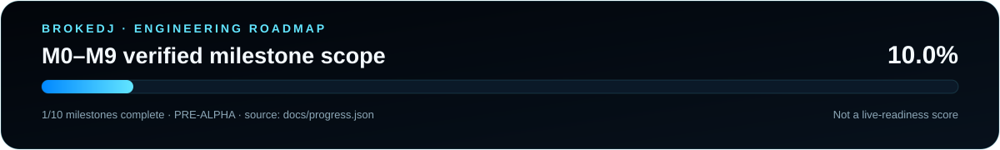

<!-- SWIR-README-STANDARD:v2 -->
<div align="center">


<br>

<a href="https://github.com/Swir/BrokeDJ/actions/workflows/build.yml"></a>


<a href="LICENSE"></a>

**An open-source DJ workstation with a professional destination — and an honest development status.**  
Windows 11 x64 first · Native C++ audio · No subscription, ads, or mandatory account

[**Current build**](#current-build) · [**Roadmap**](ROADMAP.md) · [**Build**](docs/BUILDING.md) · [**Architecture**](docs/ARCHITECTURE.md) · [**Validation**](docs/TESTING.md)

</div>

> **Development build 0.1.0, not a production release.** BrokeDJ is being built toward a full four-deck DJ workstation. VST3 hosting, beat sync, key lock, a full effects collection, a sampler, stems and a persistent music library are planned, not finished features. Do not use this build as your only system at a live event.

## Current build

| Area | Implemented in source | Validation / limits |
|---|---|---|
| Audio core | Four stereo decks; variable-rate playback; start/pause; seek; whole-track loop; hybrid rate conversion with Catmull-Rom when no downsampling filter is needed and a prepared band-limited windowed-sinc path for speed-up/downsampling; smoothed transport/EQ/FX transitions | Core tests cover deterministic transport and automation behavior. Rate changes pitch; no key lock or beat grid. |
| Mixer | Channel gain; basic three-band EQ; equal-power crossfader; master gain; smooth master/cue output safety stage | A/C are assigned left, B/D right. The safety stage is not a transparent/look-ahead limiter; the mixer is not yet fully configurable. |
| Effects | Fixed 250 ms feedback echo and saturation per deck | Two effects, not 40 presets disguised as effects. Beat sync and effect chains are pending. |
| Cue | Pre-fader, post-EQ/FX stereo headphone bus | Outputs 3/4 only. Two-output devices do not receive cue mixed into master. Physical hardware validation pending. |
| Import | Background import of local WAV, AIFF, FLAC, OGG and MP3 through JUCE. Small tracks use the in-memory path; larger tracks use a bounded background read-ahead cache with a sparse waveform preview. | Mono/stereo, 8–384 kHz. The old fixed 256 MiB decoded-whole-track ceiling is retired for the streaming path, but long-file seek/loop/slow-storage underrun behavior still needs stress and listening validation. |
| Interface | Four deck panels, waveforms, drag/drop, audio settings and clickable `by Swir` credit | Native JUCE source; Windows CI builds and headless GUI lifecycle smoke tests, while clean-machine/manual usability qualification remains separate. |
| Language | Polish selected for a Polish system; otherwise English | Decoder diagnostics currently fall back to English. No global translation claim. |
| Reliability | Immutable clip handoff; deferred destruction; smooth bounded output safety; shutdown cancellation; smoothed control automation; bounded stream cache for large tracks | Core ASan/UBSan checks and Windows build pipeline exist. No latency, ASIO, controller or live reliability certification. |

The master/cue safety curve leaves the normal region unchanged and progressively compresses only the top output region toward a 0.98 ceiling. It is **not** a transparent look-ahead or true-peak limiter. The clipping warning is based on the signal before this protection, so lower gain when it appears. The waveform is an amplitude preview, not detected beats or musical phrases. Variable-rate playback now uses a prepared 24-tap Blackman-windowed sinc filter bank when the effective source step exceeds one frame per output sample, reducing out-of-band energy before downsampling; the lower-cost Catmull-Rom path remains for steps that do not need that anti-alias filter. This is still pitch-changing resampling, **not** time-stretch/key lock or proof of inaudibility on all material. The large-track cache prevents full-file RAM growth; it does not yet prove dropout-free playback on every disk, codec or seek pattern.

## Project status



**Roadmap scope:** M0–M9 equal-weight engineering milestones · **1/10 complete · 10.0%**.  
Source of truth: [`docs/progress.json`](docs/progress.json). This number is not sound-quality, time-remaining, beta-readiness or live-performance readiness.

| Item | Status |
|---|---|
| Current stage | Pre-alpha / development |
| Primary platform | Windows 11 x64 |
| Latest public release | Not published yet |
| Native Windows CI | Build + core tests + GUI lifecycle smoke |
| Hardware qualification | Pending |
| Roadmap | [`ROADMAP.md`](ROADMAP.md) |

## Highlights

| Feature | What it provides today |
|---|---|
| Four native decks | Independent stereo playback engines and deck controls |
| Safer transport | Short transition crossfades around play/pause/seek discontinuities instead of abrupt jumps |
| Improved rate conversion | Catmull-Rom interpolation for non-downsampling playback plus prepared band-limited windowed-sinc filtering when speed-up/downsampling requires anti-alias protection; key lock remains a future milestone |
| Bounded long-track playback | Large local tracks use a fixed-size, lock-free sample cache filled by a background reader instead of decoding the entire track into RAM |
| Independent headphone cue | Dedicated logical outputs 3/4 when the selected interface provides four output channels |
| Safer output ceiling | A smooth allocation-free master/cue safety curve bounds extreme output while preserving pre-protection overload diagnostics |
| Real-time-safe core direction | No disk/network I/O, decoding, allocation or blocking mutex in the audio callback |
| Honest validation | Core, Windows build, GUI smoke and hardware/manual gates are reported separately |

## Product destination

**Performance:** four fully equipped decks, corrected beat grids, tempo/key analysis, key lock, hotcues, beat loops, slip, reverse and scratch workflows.

**Sound:** a configurable mixer, approximately 30–40 genuinely distinct built-in effects, serial/parallel chains, effect sends, XY/macros, presets and external VST3 effects. The VST3 scanner, isolation model and licensing review are separate engineering gates.

**Creative tools:** sample banks, importing your own samples and loops, live sampling, separate stem playback and optional source separation. CPU preparation comes before claims of universal real-time AI.

**Library and hardware:** searchable persistent collections, playlists, tags, session/history backups, MIDI Learn, tested controller mappings, recording and later interoperability/DVS modules.

See [`ROADMAP.md`](ROADMAP.md) for acceptance criteria. Professional scope is the destination, not a claim that this pre-alpha build already matches commercial tools.

## Quick Start

### Windows 11 x64

Install Git, CMake 3.24 or later and Visual Studio 2022 Build Tools with **Desktop development with C++** and a Windows SDK. VS Code with C/C++ and CMake Tools is the recommended editor, not a runtime requirement.

```powershell
git clone https://github.com/Swir/BrokeDJ.git
cd BrokeDJ
cmake --preset windows
cmake --build --preset windows-release
ctest --preset windows-release
.\build\windows\BrokeDJ_artefacts\Release\BrokeDJ.exe
```

JUCE is fetched automatically at the pinned upstream commit. The initial configure needs internet access. The built application works with local files without an account or Python installation. See [`docs/BUILDING.md`](docs/BUILDING.md) for offline dependency preparation and packaging.

### Test the audio core without JUCE or audio hardware

```sh
cmake -S . -B build/core -DBROKEDJ_BUILD_APP=OFF -DCMAKE_BUILD_TYPE=Debug
cmake --build build/core
ctest --test-dir build/core --output-on-failure
```

## First session

Open **Audio settings** and select your output device. Start with low hardware volume. Load a file onto a deck or drop it onto its panel, wait for import/cache preparation, then press PLAY. Click its waveform to seek. CUE 0 pauses and returns to the start; LOOP repeats the **whole track**. Turn ECHO or DRIVE to hear the two initial effects.

The crossfader sends A/C to the left side and B/D to the right. For independent stereo headphone cue, enable four output channels and connect an appropriate interface: master goes to logical outputs 1/2, headphones to 3/4. A normal two-channel output cannot provide two independent stereo pairs.

## Downloads and release policy

There is no manually qualified release yet. Successful GitHub Actions builds produce **development artifacts**, not an assertion of live-performance readiness. Windows releases require a clean-machine launch, audio-device checks, controller/soak tests appropriate to the release scope, corresponding source and dependency notices. An installer, signing and automatic updater are not implemented.

## Troubleshooting

| Symptom | Check |
|---|---|
| No sound | Open audio settings; verify the selected device, channel gain, master and crossfader. Inspect the master status. |
| No headphone cue | Enable four outputs. Cue is deliberately not folded into a two-channel master. |
| Track will not load | Check codec, corruption, mono/stereo channel count and 8–384 kHz sample rate. The previous working audio is retained on import failure. |
| Gap after a long-file seek | The bounded cache requests the new region asynchronously. Read-ahead/underrun recovery and loop-edge stress testing are still active hardening work. |
| Tempo affects pitch | Expected in this build; high-quality key lock/time-stretch is a future gate. |
| Build cannot fetch JUCE | Check Git/proxy/network configuration or use an offline checkout as described in the build guide. |
| Audible discontinuity remains | Record exact file/rate/action details. Transport smoothing reduces abrupt changes but hardware/codec stress validation is still ongoing. |

Runtime diagnostics use JUCE's application log directory under `BrokeDJ/BrokeDJ.log`. Logs can contain local filenames; review them before posting an issue.

## Repository structure

| Location | Responsibility |
|---|---|
| `src/core/` | JUCE-independent engine, controls, meters, immutable clip handoff and bounded stream cache |
| `src/app/` | Native interface, decoder/read-ahead workers and device integration |
| `tests/` | Deterministic core, quality-transition, streaming-cache, render-metric and concurrent handoff tests |
| `assets/readme/` | README PRO hero and generated SVG-only progress visuals |
| `docs/` | Architecture, build instructions, validation and progress evidence |
| `.github/workflows/` | Windows build, core tests and development artifact packaging |

## Contributing and license

Read [`CONTRIBUTING.md`](CONTRIBUTING.md), [`docs/ARCHITECTURE.md`](docs/ARCHITECTURE.md) and [`THIRD_PARTY_NOTICES.md`](THIRD_PARTY_NOTICES.md). BrokeDJ-authored code and artwork use **AGPL-3.0-only**. JUCE 9.0.2 is used through its AGPLv3 licensing option; its own dependencies retain their licenses. No proprietary plugins, commercial music or copyrighted sample packs are bundled.

## 🔎 Search Keywords

`open source DJ software` • `Windows 11 DJ mixer` • `C++ JUCE audio workstation` • `four deck DJ software` • `native DJ application` • `DJ headphone cue` • `DJ audio effects` • `real time audio C++` • `band limited audio resampling` • `bounded audio streaming` • `DJ read ahead cache` • `open source music mixing` • `DJ software Windows x64` • `CMake audio application` • `BrokeDJ` • `Swir DJ software`

<div align="center">

### `MIX • TEST • PERFORM • EVOLVE`

⭐ **If BrokeDJ is useful to you, consider leaving a star.**

[**← SWIR profile**](https://github.com/Swir) · [**All projects →**](https://github.com/Swir?tab=repositories)

**BrokeDJ — by [Swir](https://github.com/Swir)**

</div>
